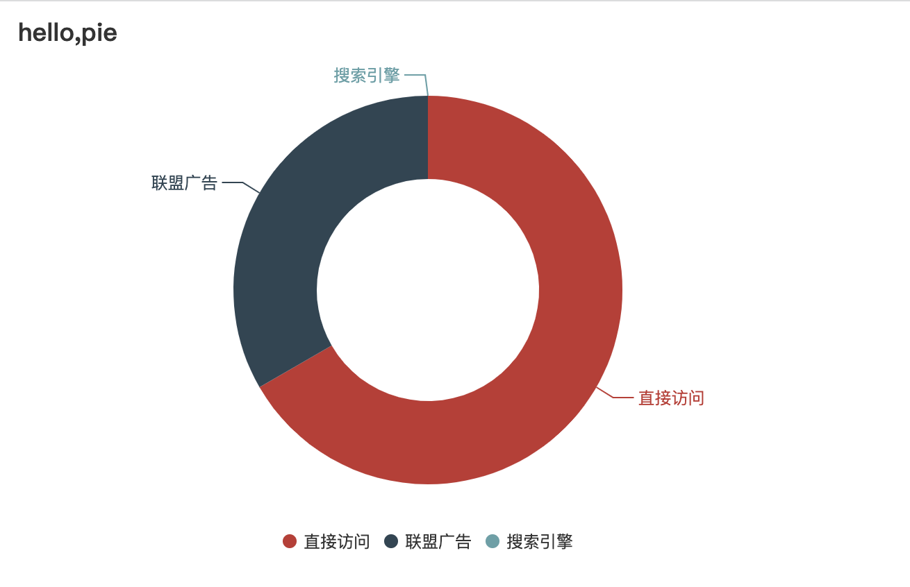

## 封装 echarsManage

#### 应用场景

<div align="center">
  
</div>

index.html

```
 <div id="main" style="width:600px;height:400px;"></div>
```

index.js

```
let aecharsManage = new AecharsManage()
let options = {
title:{
  text:'hello,pie'
},
source:[
  {
    value:200,
    name:'直接访问'
  }，
  {
    value:100,
    name:'联盟广告'
  }，
  {
    value:0,
    name:'搜索引擎'
  }，
]
}
aecharsManage.createPie('#main',options)
```

#### 创建 AecharsManage 类

```bash
import * as echars from 'echars'
import { PieChart } from 'echars/charts'
echars.use(
  [PieChart]
)
class AecharsManage {
  # 唯一标识
  static #id = -1
  # 创建Pie
  createPie(domString,options){
    let { dataset,dataset:{ dimensions = null } = {} ,tooltip,tooltip:{ formatter:tooltip_formatter = {} } = {}, event, source, title='', series,series:{ label:{ formatter = {} } = {} }} = options
    let chartDom = domString
    if( typeof domString === 'string') {
      chartDom = document.querySelector(domString)
    }
    if( !( chartDom instanceof HTMLElement ) ) {
      return
    }
    let myChart = echars.init(chartDom)
    let option =  {
      title,
      legend:{
        icon:'circle',
        bottom:'2%',
        left:'center',
        itemWidth:10,
        itemHeight:10,
      },
      tooltip:{
        show:tooltip_formatter,
        backgroundColor:'rgba(0,0,0,0.75)',
        borderColor:'rgba(0,0,0,0.75)',
        textStyle:{
          color:'#fdfdfd',
        }
        formatter(params){
           if( typeof tooltip_formatter === 'function' ) {
             return tooltip_formatter.call( null,{ ...params } )
           }
        },
        dataset:{
          dimensions,
          source,
        },
        series:[
          {
            type:'pie',
            label:{
              show:true,
              formatter(params){
                 if( typeof formatter === 'function' ) {
                   return formatter.call(null,{ ...params })
                 }
              }
            },
            height:'90%',
            radius:['40%','70%']
          }
        ]
      }
    }
   myChart.setOption(option)
   for( let key in event ) {
     let fn = event[key]
     myChart.on( key,function (params) {
       if( typeof fn === 'function' ) {
         fn.call(null,params)
       }
     } )
   }
   this[++this.#id] = myChart
   return myChart
  },
  # 私有遍历方法
  #each(fn){
    for( let {key,echars} in this ) {
      fn.call(this,echars)
    }
  }
  # 销毁所有echars
  disposeAll(){
     this.#each( (echars)=>{
       echars?.dispose?.()
     } )
  },
  # resize所有的echars
  resizAll(){
    window.addEventListener( 'resize',()=>{
      this.#each( (echars)=>{
         echars?.resize?.()
      } )
    } )
  }
}
```
