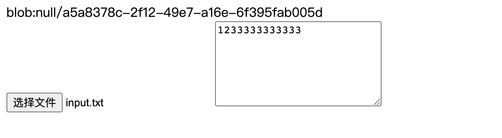

### 扩展原生 File 对象

#### 应用场景

<div align="center">
  
</div>

index.html

```
 <input type="file" id="input">
```

index.js

```
let filedom = document.querySelector('#input')
filedom.addEventListener('change',(event)=>{
  let target =  event.target
  let file = new FileSelf(target.files[0])
  file.predictFile()//文件预览
  let urlObj = file.toUrl() //生成对象url
  let div = document.createElement('div')
  div.innerHTML = urlObj.url
  document.body.insertBefore(div,filedom)
  setTimeout( ()=>{
    urlObj.destory() //销毁对象url资源
  } ,8000)
})
```

#### 实现代码

```
class FileSelf {
  constructor(file){
    let  { name,size,type } = file
    this.file = file
    this.name = name
    this.size = size
    this.type = type
  }
  // 文件大小校验
  isOverSize(size){
    size = size.toLocaleLowerCase()
    let num = parseInt(size)
    let flag = size.split(num)[1] || 'kb'
    if( this.size < Math.pow(1024,flag === 'kb' ? 1 : 2) ) {
    return false
    }
    return true
  }
  // 文件类型校验
  isValide( type ){
    type = typeof type === 'string' ? type.split(',') : []
    if( type.includes(this.type) ) {
    return true
    }
    return false
  }
  // 文件发送至服务器
  post(){
    let formData = new FormData()
    formData.append('file',this.file)
    ajax.post(url,formData)
  }
  // 读取文件内容
  readFile(){
    return new Promise((resolve,reject)=>{
      let fileReader = new FileReader()
      fileReader.readAsBinaryString(this.file)
      fileReader.onload = (event)=>{
      let result = event.target.result
      resolve(result)
      }
    })
 }
//  预览文件
 predictFile(){
    let result = this.readFile()
    result.then( text=>{
    let element = document.createElement('textarea')
    element.rows = 2
    element.cols = 50
    element.value = text
    element.style.height = '100px'
    element.style.width = '200px'
    document.body.append(element)
  } )
  }
  // 文件转url
  toUrl(){
    if( this.file instanceof File) {
      let url = ''
      return {
      url: URL.createObjectURL(this.file),
      destory: ()=>{
        URL.revokeObjectURL.apply(null,url)
      }
      }
    }
  }
}
```
