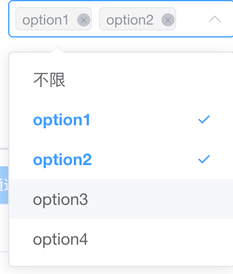
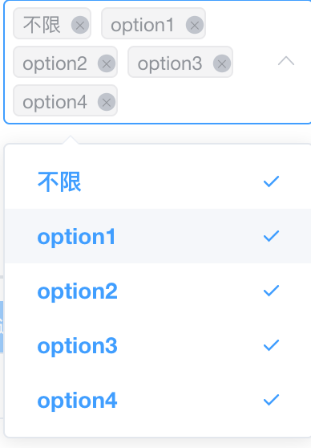

### 样式

<div align="center">
  
  
</div>

<!--  | -->

### 实现

##### html 模版

```html
<!-- html -->
<template>
  <el-select
    v-model="selfValue"
    multiple
    :placeholder="placeholder"
    :collapse-tags="collapseTags"
  >
    <el-option :label="allLabel" :value="allValue"> </el-option>
    <el-option
      v-for="(item,index) in selfOptions"
      :key="index"
      :label="item.label"
      :value="item.value"
    >
    </el-option>
  </el-select>
</template>
```

##### js 代码

```js
<script>
// js
export default {
  props: {
    value: [Array, String, Number],
    options: {
      type: Array,
      default: () => [],
    },
    // 全选的label数值
    allLabel: {
      type: String,
      default: '不限',
    },
    // 全选的value数值
    allValue: {
      type: [String, Number, Object],
      default: '',
    },
    placeholder: {
      type: String,
      default: '请选择',
    },
    collapseTags: {
      type: Boolean,
      default: true,
    },
    match: Object,
  },
  data() {
    return {
      selfOptions: [],
      oprateAll: false,
      isAdd: null,
    }
  },
  watch: {
    options: {
      immediate: true,
      deep: true,
      handler(arr) {
        let array = arr
        if (Object.prototype.toString.call(this.match) === '[object object]') {
          array = this.handelMatch(array)
        }
        this.selfOptions = array
      },
    },
  },
  computed: {
    keys() {
      let ret = []
      this.options.forEach((obj) => ret.push(obj.value))
      return ret
    },
    selfValue: {
      get() {
        let value = this.value
        if (!Array.isArray(value)) {
          value = [value]
        }
        let str = this.allValue === '' ? '[""]' : `[${this.allValue}]`
        if (
          JSON.stringify(value) === str ||
          value.filter((val) => this.keys.includes(val)).length >=
            this.keys.length
        ) {
          value = [this.allValue, ...this.keys]
        }
        this.oldValue = value
        return value
      },
      set(value, oldValue) {
        this.setAll(value, this.oldValue)
        if (this.oprateAll) {
          value = this.isAdd ? [this.allValue, ...this.keys] : []
        } else {
          let num = value.filter((value) => value !== this.allValue).length
          if (num >= this.options.length) {
            value = [this.allValue, ...this.keys]
          } else {
            let index = value.indexOf(this.allValue)
            if (index > -1) {
              value.splice(index, 1)
            }
          }
        }
        this.$emit('input', value)
      },
    },
  },
  methods: {
    setAll(val, oldValue = []) {
      if (val.length >= oldValue.length) {
        // 增加
        this.oprateAll = val
          .filter((value) => !oldValue.includes(value))
          .includes(this.allValue)
        this.isAdd = true
      } else {
        // 减少
        this.oprateAll =
          oldValue.filter((value) => !val.includes(value))[0] === this.allValue
        this.isAdd = false
      }
    },
    handelMatch(array = []) {
      let { label = 'label', value = 'value' } = this.match
      array.forEach(
        (obj) => (obj.label = obj[label]) && (obj.value = obj[value]),
      )
      return array
    },
  },
}
</script>
```
