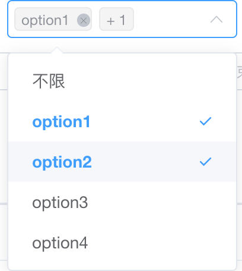
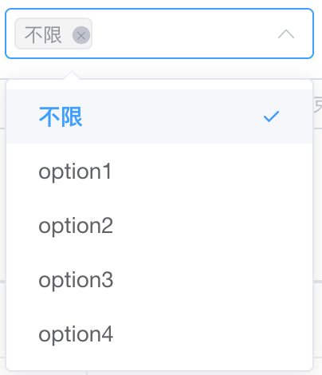

### 样式

<div align="center">
  
  
</div>

### 实现

##### html 模版

```html
<!-- html -->
<template>
  <el-select
    v-model="selfValue"
    multiple
    :placeholder="placeholder"
    :collapse-tags="collapseTags"
  >
    <el-option :label="allLabel" :value="allValue"> </el-option>
    <el-option
      v-for="(item,index) in selfOptions"
      :key="index"
      :label="item.label"
      :value="item.value"
    >
    </el-option>
  </el-select>
</template>
```

##### js 代码

```js
<script>
// js
export default {
  props: {
    value: [Array, String, Number],
    options: {
      type: Array,
      default: () => [],
    },
    // 全选的label数值
    allLabel: {
      type: String,
      default: '不限',
    },
    // 全选的value数值
    allValue: {
      type: [String, Number, Object],
      default: '',
    },
    placeholder: {
      type: String,
      default: '请选择',
    },
    isAllResult:{
      type: Boolean,
      default:false,
    }
    collapseTags: {
      type: Boolean,
      default: true,
    },
    match: Object,
  },
  data() {
    return {
      selfOptions: [],
    }
  },
  watch: {
    options: {
      immediate: true,
      deep: true,
      handler(arr) {
        let array = arr
        if (Object.prototype.toString.call(this.match) === '[object object]') {
          array = this.handelMatch(array)
        }
        this.selfOptions = array
      },
    },
  },
  computed: {
    keys() {
      let ret = []
      this.options.forEach((obj) => ret.push(obj.value))
      return ret
    },
    selfValue: {
      get() {
        let value = this.value
        if (!Array.isArray(value)) {
          value = [value]
        }
         if(!this.isAllResult && value.length === 0 ) {
           value = [this.allValue]
         }
        return value
      },
      set(value, oldValue) {
        let val = value.split()
        if( val[val.length-1] === this.allValue ) {
          val = this.isAllResult ?  [this.allValue] : []
        }else if( val[0] === this.allValue ) {
          val.splice(0,1)
        }else if( value.length === 0 ) {
          val = this.isAllResult ? [this.allValue] : []
        }
        this.$emit('input', val)
      },
    },
  },
  methods: {
    handelMatch(array = []) {
      let { label = 'label', value = 'value' } = this.match
      array.forEach(
        (obj) => (obj.label = obj[label]) && (obj.value = obj[value]),
      )
      return array
    },
  },
}
</script>
```
